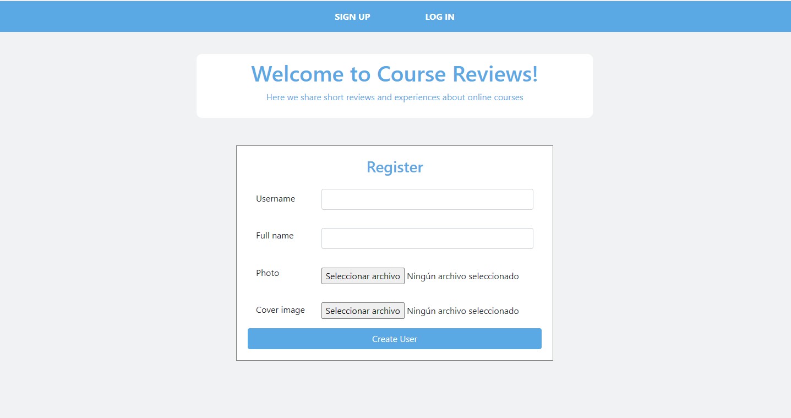
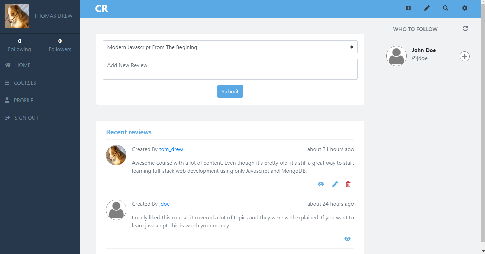
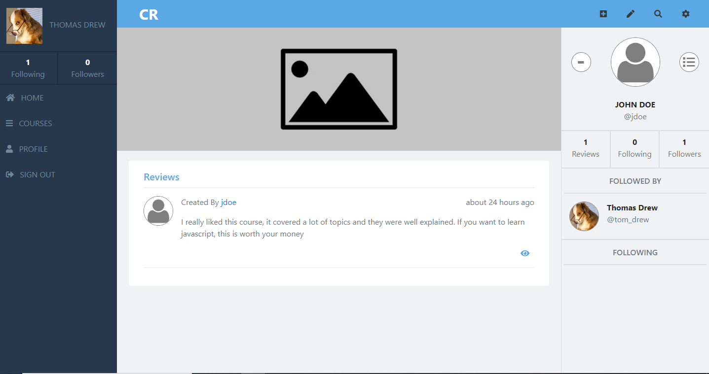
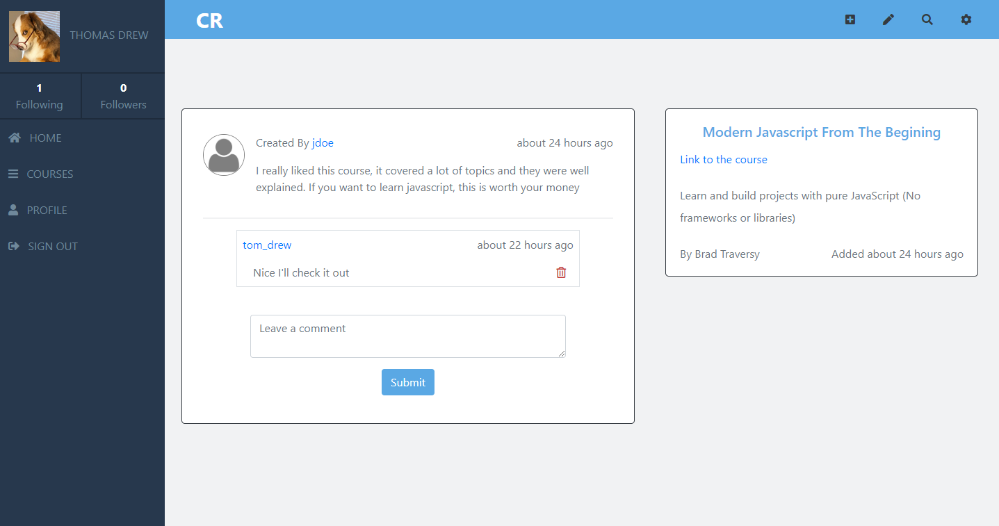

# Course Reviews

> Website to share reviews and experiences about online courses.

You can create a user with profile and cover photos, create courses, reviews, comments and follow other users

## Built With

- Ruby v2.7.0
- Rails 6.0.3.2
- Bootstrap
- PostgreSQL
- Coludinary

## Live Demo

[Live Demo Link](https://quiet-ocean-76923.herokuapp.com)

## Getting Started

To get a local copy up and running follow these simple example steps.

### Prerequisites

- Ruby: 2.7.0
- Rails: 6.0.3.2
- Postgres: >=9.5

### Setup

Instal gems with:

`bundle install`

Setup database with:

`rails db:create
   rails db:migrate`

### Usage

Start server with:

`rails server`

Open http://localhost:3000/ in your browser.

### Run tests

`rpsec --format documentation`

## Authors

👤 **Author**

- Github: [@Blasco9](https://github.com/Blasco9)
- Linkedin: [Julian Blasco](https://www.linkedin.com/in/julian-augusto-blasco-1656a0153/)

## 🤝 Contributing

Contributions, issues and feature requests are welcome

Feel free to check the [issues page](issues/).

## Show your support

Give a ⭐️ if you like this project!

## Acknowledgments

- Design Gregoire Vella
- The Odin Project
- Microverse

## 📝 License

This project is [MIT](lic.url) licensed.
